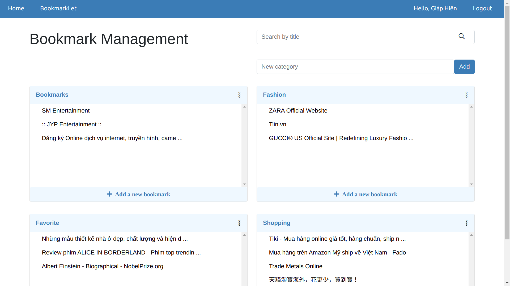

## Project Bookmark Manager

***Bookmark Manager allows you to manage website links for future. Especially, you can create bookmark with a few click.***

## Pre-requisite
1. Installed python3, to check:
    - `python --version`
2. Install npm, yarn, to check:
    - `npm --version && yarn --version`
3. Install docker or mysql, to check: 
   - `docker --version`
## BackEnd
### 1. Create venv
- `python -m venv venv`
- `pip install -r requirements.txt`

### 2. Create database in mysql (docker)
- `docker pull mysql`
- `docker run --name mysql_docker -p 3306:3306 -e MYSQL_ROOT_PASSWORD=root -d mysql`
- `docker exec -it mysql_docker bash`
- `mysql -u root -p root`
- `UPDATE mysql.user SET host = '%' WHERE user = 'root';`
- `CREATE DATABASE Bookmark_manage;`
- `GRANT ALL PRIVILEGES ON Bookmark_manage.* TO 'root'@'%';`
- `FLUSH PRIVILEGES;`

### 3. Run server
- `python migrate`
- `python manage.py createsuperuser`
- `python manage.py runserver`
- To use the external login function, you need to add a client and secret key. [Facebook app](https://developers.facebook.com/apps/create/) and [Google app](https://console.cloud.google.com/projectcreate)

## FrontEnd
**You need to change directory first**
- `cd frontend`
### 1. Install package
- `yarn`
### 2. Run react app
- `yarn start`

## Docs for api
- **You need to run server first!**
- Open your favorite browser, go to `localhost:8000/redoc/`

# Let's enjoy it.
